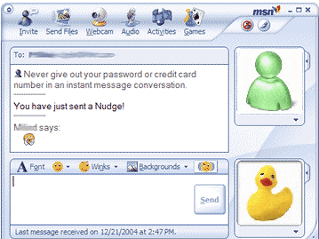
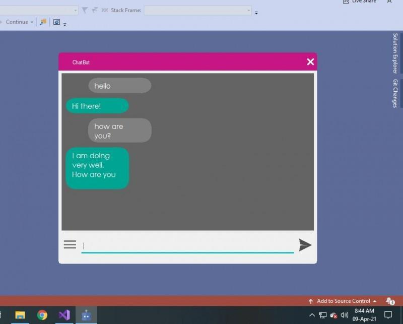

  <a href="#en">EN</a> · 
  <a href="#fr">FR</a>

# WIZZ Mania

***MSN est de retour !***

## Introduction du sujet

Dans les années l’avènement émerger 2000, d’internet a vu des communication outils et le de plus populaire d’entre eux était MSN Messenger et son mythique wizz.

Cet outil utilise les communications via réseau en protocole TCP/IP. Le protocole TCP/IP est l'un des protocoles fondamentaux permettant des communications fiables entre des machines sur un réseau. Ce projet propose de mettre en œuvre une application de chat en temps réel utilisant ce protocole.

## Contexte

Comme vous pouvez l’imaginez, l’objectif de ce sujet sera de réaliser une application **de chat** à l’aide de **TCP/IP** et de **C++**.

Vous allez devoir créer deux applications :

- **Serveur** : un serveur centralisé capable de gérer plusieurs connexions de clients.

- **Client** : une application cliente capable de se connecter au serveur et d'envoyer/recevoir des messages. 

Sans oublier de créer une interface pour visualiser l’ensemble :

- **Interface Utilisateur** : ajouter une interface utilisateur simple en utilisant une bibliothèque comme Qt pour rendre l'application plus conviviale.

A noter que vous allez devoir créer 2 projets : 1 pour le client et 1 pour le serveur, même si une partie du code est commune. Vous pouvez
éventuellement faire un seul projet qui vous demande le profil de l’application lancée, mais vous devrez être capable de démarrer plusieurs fois le projet
pour faire communiquer le client et le serveur ensemble. 

***Il est crucial de bien structurer vos applications et de respecter l’ordre des connexions entre un client et un serveur ainsi que les étapes de communication.***

**Il est primordial d’effectuer des tests automatisés. Il vous faut tester vos fonctionnalités principales.**

## Aller plus loin

Amusez vos utilisateurs et donnez leur la possibilité de jouer à des jeux ou applications intégrés qui sont accessibles par toutes les personnes du chat.
Vous devez les développer de A à Z.

## Compétences visées

- Installer et configurer son environnement de travail en fonction du projet.
- Développer des interfaces utilisateur
- Développer des composants métier
- Contribuer à la gestion d'un projet informatique
- Analyser les besoins et maquetter une application
- Définir l'architecture logicielle d'une application
- Préparer et exécuter les plans de tests d'une application

## Rendu

Votre travail est évalué en présentation avec un support et une revue de code. Le slide doit être composé de :

- De l’organisation de votre équipe
- De vos problèmes rencontrés ainsi que les solutions apportées
- La démonstration fonctionnelle Le projet est à rendre sur https://github.com/prenom-nom/wizzMania

## Base de connaissances

- [Librairie Winsock de windows ou en français](https://learn.microsoft.com/en-us/windows/win32/winsock/getting-started-with-winsock)
- [Avec C++](https://learn.microsoft.com/en-us/cpp/parallel/multithreading-with-c-and-win32?view=msvc-170)
- [Librairie STL](https://www.simplilearn.com/tutorials/cpp-tutorial/cpp-standard-template-library#c_stl)
- [POO](https://learn.microsoft.com/fr-fr/dotnet/csharp/fundamentals/tutorials/oop)
- [Tests Unitaires](https://learn.microsoft.com/fr-fr/visualstudio/test/unit-test-basics?view=vs-2022)

  <a href="#en">EN</a> · 
  <a href="#fr">FR</a>

# WIZZ Mania

***MSN is back!***

## Subject Introduction

In the 2000s, the emergence of the internet saw communication tools proliferate, and the most popular among them was MSN Messenger and its legendary wizz.

This tool uses network communications via TCP/IP protocol. TCP/IP protocol is one of the fundamental protocols enabling reliable communications between machines on a network. This project proposes to implement a real-time chat application using this protocol.

## Context

As you can imagine, the objective of this project will be to create a **chat application** using **TCP/IP** and **C++**.

You will need to create two applications:

- **Server**: a centralized server capable of managing multiple client connections.

- **Client**: a client application capable of connecting to the server and sending/receiving messages.

Don't forget to create an interface to visualize everything:

- **User Interface**: add a simple user interface using a library like Qt to make the application more user-friendly.

Note that you will need to create 2 projects: 1 for the client and 1 for the server, even if some code is shared. You could potentially make a single project that asks you for the application profile when launched, but you will need to be able to start the project multiple times to make the client and server communicate together.

***It is crucial to properly structure your applications and respect the order of connections between a client and a server as well as the communication steps.***

**It is essential to perform automated tests. You must test your main functionalities.**

## Going Further

Have fun with your users and give them the possibility to play games or integrated applications that are accessible to everyone in the chat.
You must develop them from scratch.

## Target Skills

- Install and configure your work environment according to the project.
- Develop user interfaces
- Develop business components
- Contribute to the management of an IT project
- Analyze requirements and prototype an application
- Define the software architecture of an application
- Prepare and execute application test plans

## Deliverables

Your work is evaluated through a presentation with supporting materials and code review. The slides should include:

- Your team organization
- The problems encountered and the solutions provided
- The functional demonstration The project should be submitted to https://github.com/firstname-lastname/wizzMania

## Knowledge Base

- [Windows Winsock Library or in French](https://learn.microsoft.com/en-us/windows/win32/winsock/getting-started-with-winsock)
- [With C++](https://learn.microsoft.com/en-us/cpp/parallel/multithreading-with-c-and-win32?view=msvc-170)
- [STL Library](https://www.simplilearn.com/tutorials/cpp-tutorial/cpp-standard-template-library#c_stl)
- [OOP](https://learn.microsoft.com/fr-fr/dotnet/csharp/fundamentals/tutorials/oop)
- [Unit Tests](https://learn.microsoft.com/fr-fr/visualstudio/test/unit-test-basics?view=vs-2022)